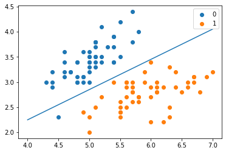
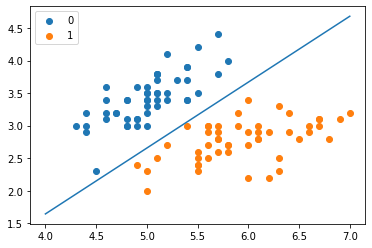

# 逻辑斯谛回归与最大熵模型

## 1. 逻辑斯谛回归模型

### 逻辑斯谛分布

* 逻辑斯谛回归是分类方法。设下是连续随机变量，X服从逻辑斯谛分布是指X具有下列分布函数和密度函数：
$$
F(x)=P(X\le x)=\frac{1}{1+e^{-(x-\mu) / \gamma }}
$$

$$
f(x)=F^{'}(x)=\frac{e^{-(x-\mu) / \gamma }}{\gamma (1+e^{-(x-\mu) / \gamma })^2}
$$

分布函数属于逻辑斯谛函数，其图形是一条S形曲线，该曲线以点$(\mu,\frac{1}{2})$为中心对称，其满足
$$
F(-x+\mu)-\frac{1}{2}=-F(x+\mu)+\frac{1}{2}
$$

曲线在中心附近增长速度较快，在两端增长速度较慢。形状参数$\gamma$的值越小，曲线在中心附近增长得越快。

### 二项逻辑斯谛回归模型

$$
P(Y=1|x)=\frac{e^{(w·x+b)}}{1+e^{(w·x+b)}}
$$

$$
P(Y=0|x)=\frac{1}{1+e^{(w·x+b)}}
$$

* 逻辑斯谛回归模型的特点：一个事件的几率是指该事件发生的概率与该事件不发生的概率的比值。

### 模型参数估计

应用极大似然估计法估计模型参数，逻辑斯谛回归学习中通常采用的方法是梯度下降法及拟牛顿法。

### 多项逻辑斯谛回归

假设离散型随机变量Y的取值集合是${1,2,...,K}$，那么多项逻辑斯谛回归模型是
$$
P(Y=k|x)=\frac{e^{w_k·x}}{1+\sum_{k=1}^{K-1}e^{(w_k·x)}}
$$

$$
P(Y=K|x)=\frac{1}{1+\sum_{k=1}^{K-1}e^{(w_k·x)}}
$$

#### 回归模型

$$
f(x) = \frac{1}{1+e^{-wx}}
$$

## 2.最大熵模型

* 熵就是随机事件的不确定性，熵越小信息就越明确。

### 最大熵原理

* 最大熵原理是概率模型学习的一个准则。最大熵原理认为，学习概率模型时，在所有可能的概率模型中，熵最大的模型是最好的模型。通常用约束条件来确定概率模型的集合，所以，最大熵原理也可以表示为在满足约束条件的模型集合中选取熵最大的模型。

* 假设离散随机变量X的概率分布时$P(X)$，则其熵是
$$
H(P)=-\sum_{x}P(x)logP(x)
$$

熵满足下列不等式：

$$
0\le H(P) \le log|X|
$$

当且仅当X的分布是均匀分布时右边的等号成立，也就是熵最大。

### 最大熵模型的定义

特征函数$f(x,y)$关于经验分布$\hat{P}(X,Y)$的期望值，用$E_{\hat{p}}(f)$表示

$$
E_{\hat{p}}(f)=\sum_{x,y}\hat{P}(x,y)f(x,y)
$$

特征函数$f(x,y)$关于模型$P(Y|X)$与经验分布$\hat{P}(X)$的期望值，用$E_p(f)$表示

$$
E_p(f)=\sum_{x,y}\hat{P}(x)P(y|x)f(x,y)
$$

假设这两个期望值相等，即$E_p(f)=E_\hat{p}(f)$，将其作为模型学习的约束条件。假设有n个特征函数$f_i(x,y)$，那么就有n个约束条件。

#### 最大熵模型

* 假设满足所以约束条件的模型集合为
$$
C\equiv {{P\in \rho | E_p(f_i)=E_\hat{p}(f_i),i=1,2,...,n}}
$$

定义在条件概率分布$P(Y|X)$上的条件熵为
$$
H(P)=-\sum_{x,y}\hat{P}(x)P(y|x)logP(y|x)
$$

则模型集合$C$中条件熵$H(P)$最大的模型成为最大熵模型。

### 最大熵模型的学习

* 相当于求一个条件分布$ P(y|x)$使得条件熵$H(P)$最大

最大熵模型的学习可以形式化为约束最优化问题。

$$
max_{P\in C}H(P)=-\sum_{x,y}\hat{P}(x)P(y|x)logP(y|x)
$$

$$
s.t. E_p(f_i)=E_\hat{p}(f_i),i=1,2,..,n
$$

$$\sum_y P(y|x)=1$$

改写为求最小值问题：
$$
min_{P\in C}-H(P)=\sum_{x,y}\hat{P}(x)P(y|x)logP(y|x)
$$

$$
s.t. E_p(f_i)-E_\hat{p}(f_i)=0,i=1,2,..,n
$$

$$\sum_y P(y|x)=1$$

* 得出的最大熵模型为

$$
P_w(y|x)=\frac{1}{Z_w(x)}exp(\sum_{i=1}^{n}w_if_i(x,y))
$$

其中

$$
Z_w(x) = \sum_{y}exp(\sum_{i=1}^{n}w_if_i(x,y))
$$

## 模型学习的最优化方法

### 改进的迭代尺度法

* 输入：特征函数$f_1,f_2,...,f_n$；经验分布$\tilde{P} (X,Y)$，模型$P_w(y|x)$
* 输出：最优参数值$w_i^*$；最优模型$P_w$

（1） 对所有i，取初值$w_i=0$

（2）对每一i：
    （a）令$\sigma_i$是方程

$$
    \sum_{x,y}P(x)P(y|x)f_i(x,y)exp(\sigma_i f^\#(x,y))=E_p(f_i)
$$

的解。

（b）更新$w_i$值：$w_i \gets w_i+\sigma_i$

（3）如果不是所有$w_i$都收敛，重复步（2）

求解$\sigma_i$的方法是牛顿法。

### 拟牛顿法

* 不断更新w，判断得出的w梯度是否小于某个阈值，如果小于，则w就是求出的解，否则继续更新。

### 总结

* 最大熵模型可以由最大熵原理推导得出，最大熵原理是概率模型学习或估计的一个准则。最大熵原理认为在所有可能的概率模型集合中，熵最大的模型是最好的模型。最大熵原理应用到分类模型的学习中，有以下约束最优化问题：

$$
min_{P\in C}-H(P)=\sum_{x,y}\hat{P}(x)P(y|x)logP(y|x)
$$

$$
s.t. E_p(f_i)-E_\hat{p}(f_i)=0,i=1,2,..,n
$$

$$\sum_y P(y|x)=1$$

求解此最优化问题的对偶问题得到最大熵模型。

* 逻辑斯谛回归模型与最大熵模型都属于对数线性模型。

* 逻辑斯谛回归模型及最大熵模型学习一般采用极大似然估计，或正则化的极大似然估计。逻辑斯谛回归模型及最大熵模型学习可以形式化为无约束最优化问题。求解该最优化问题的算法有改进的迭代尺度法，梯度下降法，拟牛顿法。

### code

#### 逻辑斯谛回归


```python
from math import exp
import numpy as np
import pandas as pd
import matplotlib.pyplot as plt

from sklearn.datasets import load_iris
from sklearn.model_selection import train_test_split
```


```python
# data
def create_data():
    iris = load_iris()
    df = pd.DataFrame(iris.data, columns=iris.feature_names)
    df['label'] = iris.target
    df.columns = ['sepal length', 'sepal width', 'petal length', 'petal width', 'label']
    data = np.array(df.iloc[:100, [0,1,-1]])
    return data[:,:2], data[:,-1]
```


```python
X, y = create_data()
X_train, X_test, y_train, y_test = train_test_split(X, y, test_size=0.3)
```


```python
class LogisticRegressionClassifier:
    def __init__(self, max_iter = 200, learning_rate = 0.01):
        self.max_iter = max_iter
        self.learning_rate = learning_rate
    
    def sigmoid(self, x):
        return 1 / (1 + exp(-x))
    
    def data_matrix(self, x):
        data_mat = []
        for d in x:
            data_mat.append([1.0, *d])
        return data_mat
    
    def fit(self, x, y):
        data_mat = self.data_matrix(x)
        self.weights = np.zeros((len(data_mat[0]), 1), dtype = np.float32)
        
        for iter_ in range(self.max_iter):
            for i in range(len(x)):
                result = self.sigmoid(np.dot(data_mat[i], self.weights))  # w * x
                error = y[i] - result
                self.weights += self.learning_rate * error * np.transpose([data_mat[i]])
        print('logisticregression model(learning_rate = {}, max_iter = {})'.format(self.learning_rate, self.max_iter))
        
    def score(self, x_test, y_test):
        right = 0
        x_test = self.data_matrix(x_test)
        for x, y in zip(x_test, y_test):
            result = np.dot(x, self.weights)
            if (result > 0 and y == 1) or (result < 0 and y == 0):
                right += 1
        return right / len(x_test)
```


```python
lr_clf = LogisticRegressionClassifier()
lr_clf.fit(X_train, y_train)
```

    logisticregression model(learning_rate = 0.01, max_iter = 200)


```python
lr_clf.weights
```


    array([[-0.9096042],
           [ 3.4154248],
           [-5.67529  ]], dtype=float32)


```python
lr_clf.score(X_test, y_test)
```


    1.0


```python
x_points = np.arange(4, 8)
y_ = -(lr_clf.weights[1] * x_points + lr_clf.weights[0]) / lr_clf.weights[2]
plt.plot(x_points, y_)

plt.scatter(X[:50, 0], X[:50, 1], label = '0')
plt.scatter(X[50:, 0], X[50:, 1], label = '1')
plt.legend()
```


    <matplotlib.legend.Legend at 0x162078850>





#### sklearn


```python
from sklearn.linear_model import LogisticRegression
```


```python
clf = LogisticRegression(max_iter=200)
clf.fit(X_train, y_train)
```


    LogisticRegression(max_iter=200)


```python
clf.score(X_test, y_test)
```


    1.0


```python
clf.coef_, clf.intercept_
```


    (array([[ 2.70304625, -2.67135043]]), array([-6.41989428]))


```python
x_points = np.arange(4, 8)
y_ = -(clf.coef_[0][0] * x_points + clf.intercept_) / clf.coef_[0][1]
plt.plot(x_points, y_)

plt.scatter(X[:50, 0], X[:50, 1], label = '0')
plt.scatter(X[50:, 0], X[50:, 1], label = '1')
plt.legend()
```


    <matplotlib.legend.Legend at 0x1624fee80>





#### 最大熵模型


```python
import math
from copy import deepcopy
```


```python
class MaxEntropy:
    def __init__(self, EPS = 0.005):
        self._samples = []
        self._Y = set()
        self._numXY = {}
        self._N = 0  # sample num
        self._Ep_ = []
        self._xyID = {}
        self._n = 0
        self._C = 0
        self._IDxy = {}
        self._w = []
        self._EPS = EPS
        self._lastw = []
    
    def loadData(self, dataset):
        self._samples = deepcopy(dataset)
        for items in self._samples:
            y = items[0]
            X = items[1:]
            self._Y.add(y)
            for x in X:
                if (x,y) in self._numXY:
                    self._numXY[(x,y)] += 1
                else:
                    self._numXY[(x,y)] = 1
        
        self._N = len(self._samples)
        self._n = len(self._numXY)
        self._C = max([len(sample) - 1 for sample in self._samples])
        self._w = [0] * self._n
        self._lastw = self._w[:]
        
        self._Ep_ = [0] * self._n
        for i, xy in enumerate(self._numXY):
            self._Ep_[i] = self._numXY[xy] / self._N
            self._xyID[xy] = i
            self._IDxy[i] = xy
    
    def _Zx(self, X):  # 计算每个Z(x)的值
        zx = 0
        for y in self._Y:
            ss = 0
            for x in X:
                if (x, y) in self._numXY:
                    ss += self._w[self._xyID[(x, y)]]
            zx += math.exp(ss)
        return zx
    
    def _model_pyx(self, y, X):  # 计算每个P(y|x)
        zx = self._Zx(X)
        ss = 0
        for x in X:
            if (x, y) in self._numXY:
                ss += self._w[self._xyID[(x, y)]]
        pyx = math.exp(ss) / zx
        return pyx
    
    def _model_ep(self, index):  # 计算特征函数fi关于模型的期望
        x, y = self._IDxy[index]
        ep = 0
        for sample in self._samples:
            if x not in sample:
                continue
            pyx = self._model_pyx(y, sample)
            ep += pyx / self._N
        return ep
    
    def _convergence(self):  #判断是否全部收敛
        for last, now in zip(self._lastw, self._w):
            if abs(last - now) >= self._EPS:
                return False
        return True
    
    def predict(self, X):  # 计算预测概率
        Z = self._Zx(X)
        result = {}
        for y in self._Y:
            ss = 0
            for x in X:
                if (x, y) in self._numXY:
                    ss += self._w[self._xyID[(x, y)]]
                pyx = math.exp(ss) / Z
                result[y] = pyx
        return result
    
    def train(self,maxiter = 1000):  # 训练数据
        for loop in range(maxiter):
            print('iter:%d' % loop)
            self._lastw = self._w[:]
            for i in range(self._n):
                ep = self._model_ep(i)
                self._w[i] += math.log(self._Ep_[i] / ep) / self._C # 更新参数
            print('w:', self._w)
            if self._convergence():  # 判断是否收敛
                break
```


```python
dataset = [['no', 'sunny', 'hot', 'high', 'FALSE'],
           ['no', 'sunny', 'hot', 'high', 'TRUE'],
           ['yes', 'overcast', 'hot', 'high', 'FALSE'],
           ['yes', 'rainy', 'mild', 'high', 'FALSE'],
           ['yes', 'rainy', 'cool', 'normal', 'FALSE'],
           ['no', 'rainy', 'cool', 'normal', 'TRUE'],
           ['yes', 'overcast', 'cool', 'normal', 'TRUE'],
           ['no', 'sunny', 'mild', 'high', 'FALSE'],
           ['yes', 'sunny', 'cool', 'normal', 'FALSE'],
           ['yes', 'rainy', 'mild', 'normal', 'FALSE'],
           ['yes', 'sunny', 'mild', 'normal', 'TRUE'],
           ['yes', 'overcast', 'mild', 'high', 'TRUE'],
           ['yes', 'overcast', 'hot', 'normal', 'FALSE'],
           ['no', 'rainy', 'mild', 'high', 'TRUE']]
```


```python
maxnet = MaxEntropy()
x = ['overcast', 'mild', 'high', 'FALSE']
```


```python
maxnet.loadData(dataset)
maxnet.train()
```

```python
print('predict:', maxnet.predict(x))
```

    predict: {'yes': 0.9999971802186581, 'no': 2.8197813418816538e-06}

